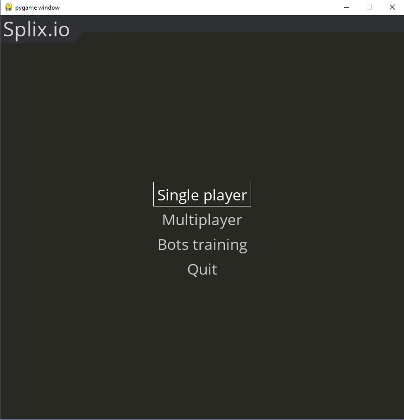
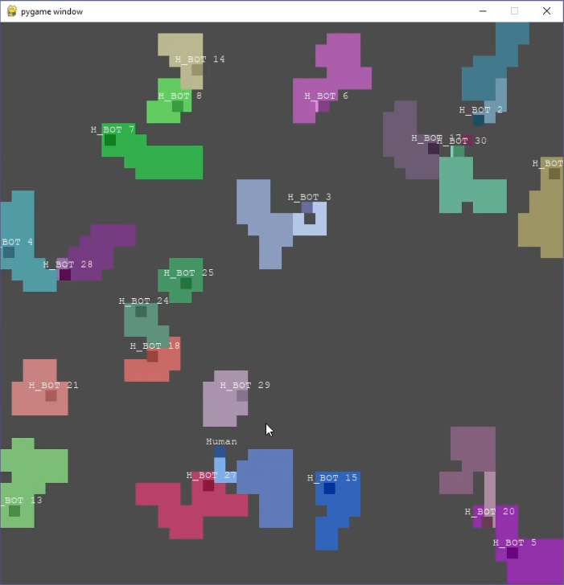
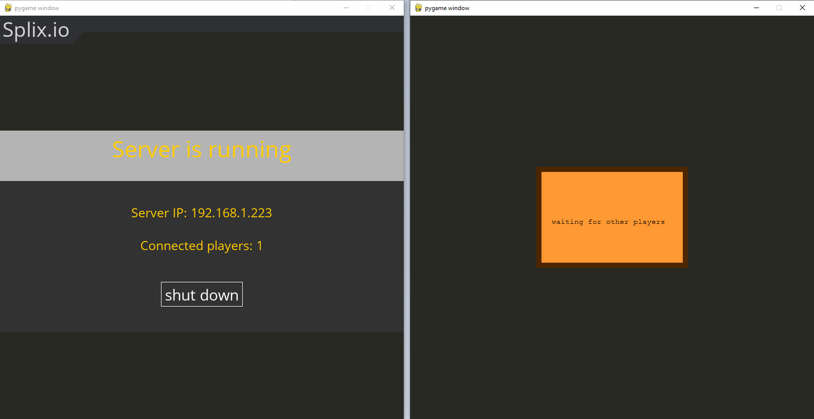

# splix.io-multiplayer-AI

## Sections
 - [Visuals](#visuals)
 - [Description](#description)
	 - [Game description and rules](#game-description-and-rules)
	 - [Artificial intelligence aspect](#artificial-intelligence-aspect)
	    - [Heuristic bots](#heuristic-bots)
	      - [Description of heuristic bots](#description-of-heuristic-bots) 
	      - [Observations of heuristic bots](#observations-of-heuristic-bots)
	    - [NEAT bots](#neat-bots)
	    	- [Description of NEAT bots](#description-of-neat-bots) 
	      - [Observations of NEAT bots](#observations-of-neat-bots)
	      - [How to train NEAT bots](#how-to-train-neat-bots)
	 - [Singleplayer aspect](#singleplayer-aspect)
	 - [Online multiplayer ascpect](#online-multiplayer-ascpect)
	    - [How to play](#how-to-play) 
	    - [Technical description](#technical-description)
 - [TODO](#todo)
 - [Usage](#usage)
 - [Links](#links)

## Visuals

### Menu

### Gameplay

### Server connection

## Description

### Game description and rules
  - Map consists of square tiles
  - Each tile can be in one of following states:
    - neutral tile (doesn't belong to any player)
    - player's safe zone tile (belong to specific player)
    - player's trail tile (player leaves trail when he is out of safe zone)
  - Each player has unique color and name
  - Player starts the game with a safe zone in the shape of a square (3x3 tiles)
  - When player joins the game, he doesn't move
  - When player moves for the first time, he is not able to stop until the end of the game (player's death)
  - Player can move in four directions: up, down, right, left
  - When player moves on his safe zone, nothing special happens
  - When player moves out of his safe zone, he leaves a trail
  - If any player crosses trail of any other player, then the owner of that trail will be eliminated from the game (player can eliminate himself by crossing his own trail)
  - When player returns to his safe zone, then whole area that is marked with his trail immediately becomes his safe zone
  - Each player has its score, which is equal to the size of their safe zone

### Artificial intelligence aspect
Game comes with two types of bots. Heuristic and NEAT.

#### Heuristic bots

##### Description of heuristic bots
Bots of this type use special heurisitc algorithm implemented by me, in order to make decisions about their future steps. Heuristic algorithm means that bots use predictions and simplified observations to decide about their steps. There are a lot of variables that can be found in constant.py, that can be changed before starting the game in order to determine how these bots will play. You can specify following things:
- how far will bot search for other players to kill - it can be two, five, or more tiles away from his current position
- how far will bot go out of his safe zone in order to kill another player - bot is constantly searching for the occasions to eliminate someone, but going to the other side of the map would be ridiculous, because the target player could easily hide in his own safe zone.
- how far will bot dare to go out of his safe zone
- what is the maximal lenght of bot's length (after reaching this length, bot will automatically go back to its safe zone)
- how far enemies should be in order to leave its own safe zone - number that will help decide whether bot is safe to leave the safe zone 
- whether bots are going to play aggressive or defensive

##### Observations of heuristic bots
When observing heuristic bots, one can already tell that those are bots and not real human players. It is because of the fact that bots are acting unnaturally, when they feel that there isn't any danger for them to be eliminated. They are making unpredictable choices about where to go. However, beyond that fact, heuristic bots play really well. They don't need much time in order to gain a lot of tiles for themselves. When bots are aggressive, they are easily able to eliminate other players, and when they are defensive they make it really hard for others to eliminate them.

#### NEAT bots

##### Description of NEAT bots
Bots of this type were trained to play the game with NeuroEvolution of Augmenting Topologies algorithm (NEAT), which is a genetic algorithm for the generation of evolving artificial neural networks. (In this project, I am using an existing implementaion of the NEAT algorithm, and not my own).

##### Observations of NEAT bots
Process of training NEAT bots requires a lot of patience. I have tried to train them in many different ways, and they are not as good as I have imagined them. Most of them learns to play with a specific scheme, they find a pattern and follow it no matter what. Examples of such patterns are presented on the picture below.    
.    
Following a pattern is good for bots, because it allows them to collect many points in a short period of time. However, I would rather teach them to play more intelligently and collect less points, than teach them to follow a pattern and collect a great number of points. One of the problems is that the environment is non deterministic, which means that bots will always spawn in a different position around different number of enemies, which makes it hard for bots to learn some efficient strategies.

##### How to train NEAT bots
When you launch a programme, you can train your own bots and then test them in a singleplayer mode. In order to experiment with different settings, go to neat.conf - configuration file, which description can be found on the neat-python website (link below). Moreover, check out constant.py file, because you can specify there many other settings. For instance you can choose to add heuristic bots to the process of learning, you can choose to visualize the training process (keep in mind that it slows down whole process so much, so visualize it only when you want to debug some problems), you can also decide to save some helpful statistics, like chart of average fitness of all genomes or image of the neural network of the best genome (saved statistics can be found in the resources folder, and they are saved after each epoch). Best genome is saved after each epoch to the resources directory. Lastly, experiment with the code, try some different inputs to the network and different outputs.

### Singleplayer aspect
The game can be played in an offline mode. In such case, player can choose the type of bots that he will be playing with (heurisitc bots, neat bots, both types). At the end of the game, when player dies, a pop up will appear presenting his score.
    
### Online multiplayer ascpect

#### How to play
Project is configured to work in a LAN network. For instance you can use hamachi to play with friends that are not in your local network.  
In order to play with others via network, someone must create a server. Other players have to connect to the given IP address. Game will start as soon as two players connect to the server. Currently only one server can be created at given moment and only 13 players can connect to him (it can be easily change in constant.py). Server will automatically shut down, when every player is dead.

#### Technical description
The communication is based on a client-server architecture. When server is started, it listens for TCP connections from players. First connection is establisehd using TCP protocol, because it is reliable. Server must receive player's name and player must receive his id. After transporting these first initial information, server starts to exchange some meaningless data in the background (1 byte per few seconds, still using TCP protocol), to make sure that connection has not been broken. When game starts (two or more players connect to the server), server must inform all connected players about it (also with TCP). However, when the game is started, client-server communication switches to UDP protocol. Player sends to the server his id and the direction he wants to move, and server replies with the data about the game. UDP is used, because it is much faster than TCP. UDP is not reliable, but we can afford to lose some data in the process, because we know it will be resend in the next iteration.

## TODO
 - Implement possibility to add bots to online games
 - Implement players' ranking
 - Implement possibility to create more than one server (list of servers that player could choose from)
 - Add marker that would help locate player's position (now you have to look for the name on the map)

## Usage
 - University Project
 - Playable game
 - Training NEAT bots

## Links
 - https://splix.io/ (original game)
 - https://neat-python.readthedocs.io/en/latest/config_file.html (neat configuration file description)
